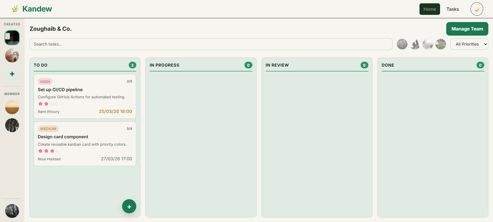
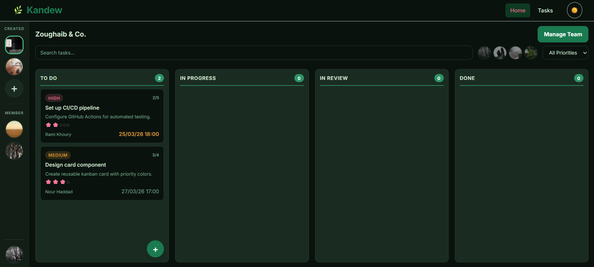
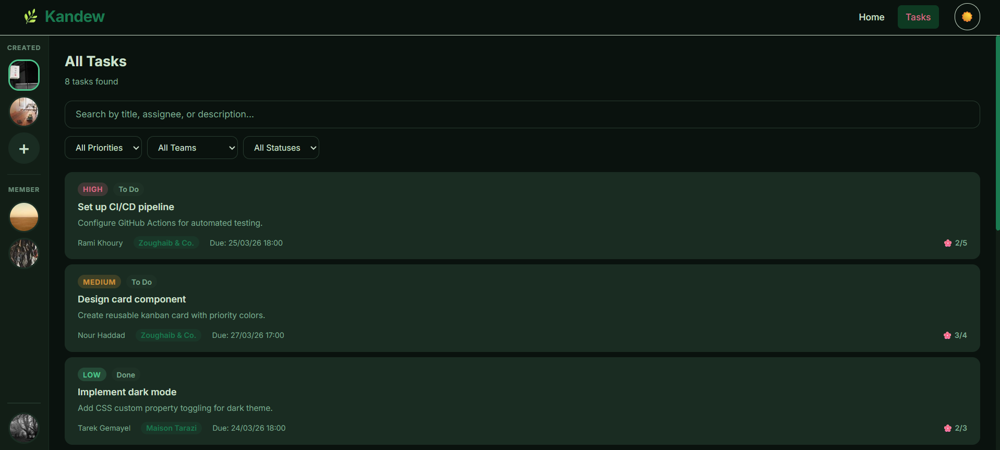
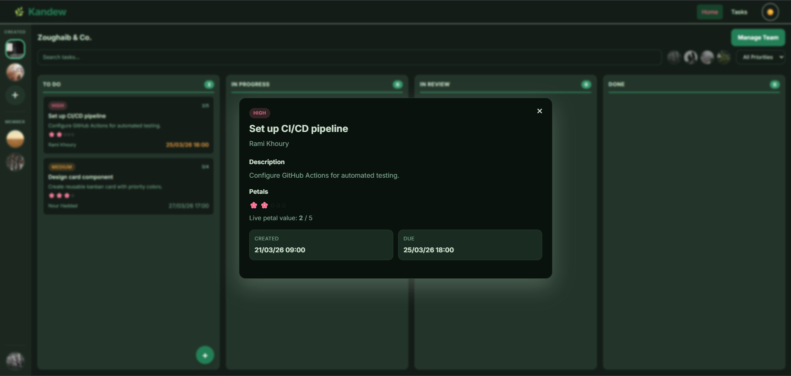
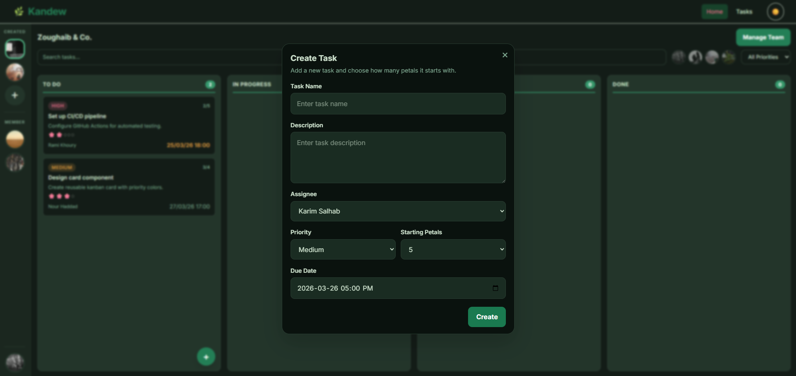
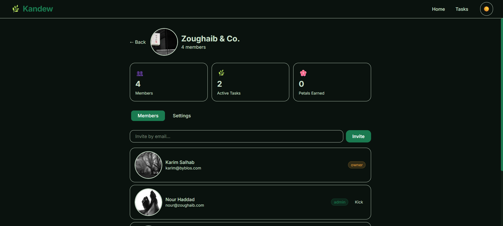
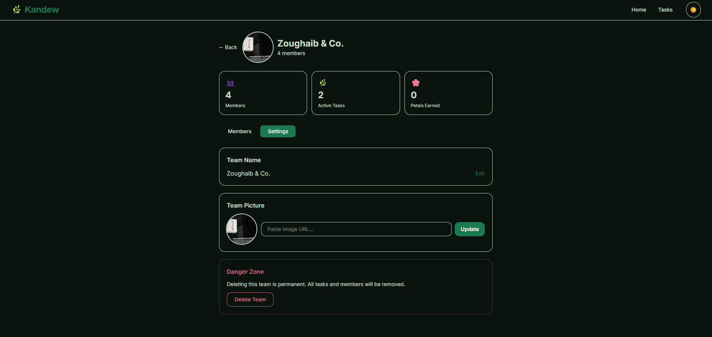
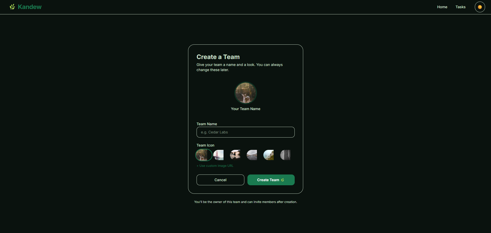
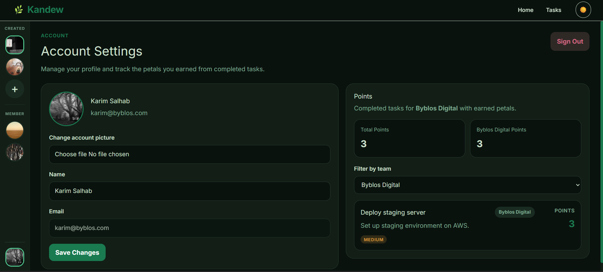

# KANDEW

A team-based kanban board for managing tasks. Built with React, Tailwind CSS, and React Router.

**Topic:** Task Management / Kanban Board

**Data Entities:** Teams, Tasks, Members, Petals (scoring)

**Deployed Application:** https://saadardati.github.io/kandew

## Team Members

| Name         | Pages                                           |
| ------------ | ----------------------------------------------- |
| Saad Ardati  | Home (Kanban Board), Tasks (List View)          |
| Leen Nassar  | Team Creation, Team Management                  |
| Nour Mardini | Account Settings, Task Details, Task Creation   |
| Lynn Hamieh  | Login, Register, Forgot Password, Setup Profile |

## Running the Frontend Locally

### 1. Prerequisites

Make sure you have the following installed:

- Node.js (version 18 or 20 recommended)
- npm (comes with Node.js)

Check installation:

```bash
node -v
npm -v
```

### 2. Clone the Repository

```bash
git clone https://github.com/SaadArdati/kandew.git
cd kandew
```

### 3. Install Dependencies

```bash
npm install
```

### 4. Start the Development Server

```bash
npm run dev
```

### 5. Open the Application

After running the server, you will see a local URL such as:

```bash
http://localhost:5173/
```

Open this link in your browser to view the application.

## Pages

1. **Home** — Kanban board with drag-and-drop, team switching, task creation, and filter bar
2. **Tasks** — List view of all tasks with search bar and filters (priority, team, status)
3. **Login** — Email/password login with validation
4. **Register** — Account registration with validation
5. **Forgot Password** — Password reset request
6. **Setup Profile** — Post-registration profile completion with avatar selection
7. **Account Settings** — User profile, petal points tracking, sign out
8. **Team Creation** — Create new teams with name and icon
9. **Team Management** — Manage members, rename team, view stats

## Features

- Light/dark theme toggle
- Drag-and-drop task movement between columns
- Petal scoring system — tasks lose petals as the due date approaches
- Task creation with assignee, priority, due date, and petal count
- Team sidebar with created/member sections
- Member avatar bubble filters on the kanban board
- Responsive design — works on mobile, tablet, and desktop
- Form validation on all input forms
- Modals for task details and task creation
- Due date alerts for tasks nearing their deadline
- Role-based access — only team creators can add tasks

## Screenshots

### Home Page (Light Mode)



### Home Page (Dark Mode)



### Tasks Page



### Task Dialog



### Task Creation Dialog



### Team Management (Screen One)



### Team Management (Screen Two)



### Team Creation



### Account Settings



## Contributions

### Saad Ardati

- Set up the project (Vite + React + Tailwind CSS + React Router)
- Designed the MVVM architecture and repository pattern
- Built the Home page with the kanban board, drag-and-drop, and team switching
- Built the Tasks list page with search bar and filters (priority, team, status)
- Added the kanban filter bar with member avatar bubbles and search
- Added the ThemeContext for light/dark mode with localStorage persistence
- Made the app responsive for mobile and tablet
- Designed the color scheme and CSS custom properties

### Leen Nassar

- Built the Team Creation page with team name, icon selection, and custom icon URL
- Built the Team Management page with members tab, settings tab, and danger zone
- Implemented invite/kick member functionality
- Added team rename, icon change, and delete with confirmation

### Nour Mardini

- Built the Task Details dialog popup showing full task info when a card is clicked
- Built the Task Creation dialog with name, description, assignee, priority, due date, and petal count
- Designed and implemented the petal-based scoring system:
  - Each task starts with 0-5 petals assigned by the team creator
  - Petals decrease linearly over time from creation to due date
  - When moved to Review, petals freeze at their current value
  - If moved back, petal countdown resumes
  - When moved to Done, remaining petals are awarded as points
- Built the Account Settings page with profile editing and points tracking
- Updated the team sidebar to show user-specific teams (created vs member)
- Added the due date alert system that highlights tasks nearing their deadline
- Wired the auth flow (login, register, setup profile) with route guards
- Added role-based visibility so only team creators can add tasks

### Lynn Hamieh

- Built the Login page with email and password validation
- Built the Register page with username, email, password, and confirm password validation
- Built the Forgot Password page with email validation and confirmation state
- Built the Setup Profile page with name, bio, and avatar preset selection

## Use of Mock Data

This project uses **mock data** to simulate backend interactions and enable full functionality without requiring a real server or database.

### How Mock Data is Used

- All application data (users, teams, tasks, memberships) is stored in local files (e.g., `mockData.js`).
- These files act as a **temporary data source**, similar to what a backend API would normally provide.
- The application reads from and writes to this mock data through a **repository layer** (e.g., `taskRepository.js`), which mimics API calls.

### Simulating User Interactions

Mock data is used to simulate real interactions such as:

- Creating tasks
- Updating task status (drag-and-drop between columns)
- Assigning users to tasks
- Tracking task progress and points (petals system)
- Filtering tasks and calculating statistics in the Account Settings page

All updates are handled in memory, meaning:

- Changes are immediately reflected in the UI
- No actual network requests are made

### Limitations

- Data is **not persistent** — refreshing the page resets all changes
- There is no real authentication or database storage
- Multi-user interaction is simulated rather than real

### Purpose

Using mock data allows:

- Faster development and testing
- Clear separation between frontend and backend logic
- Easy transition to a real backend in the future

All data is stored in local React state using mock arrays in `src/data/mockData.js`. The app simulates CRUD operations (
create, read, update, delete) through a repository pattern in `src/repositories/`.
The current structure (repository + mock data) is designed so that it can later be replaced with real API calls with minimal changes to the rest of the application.

## Tech Stack

- React 19 (functional components, hooks)
- React Router 7
- Tailwind CSS 4
- Vite 7
- JavaScript (ES6+)
